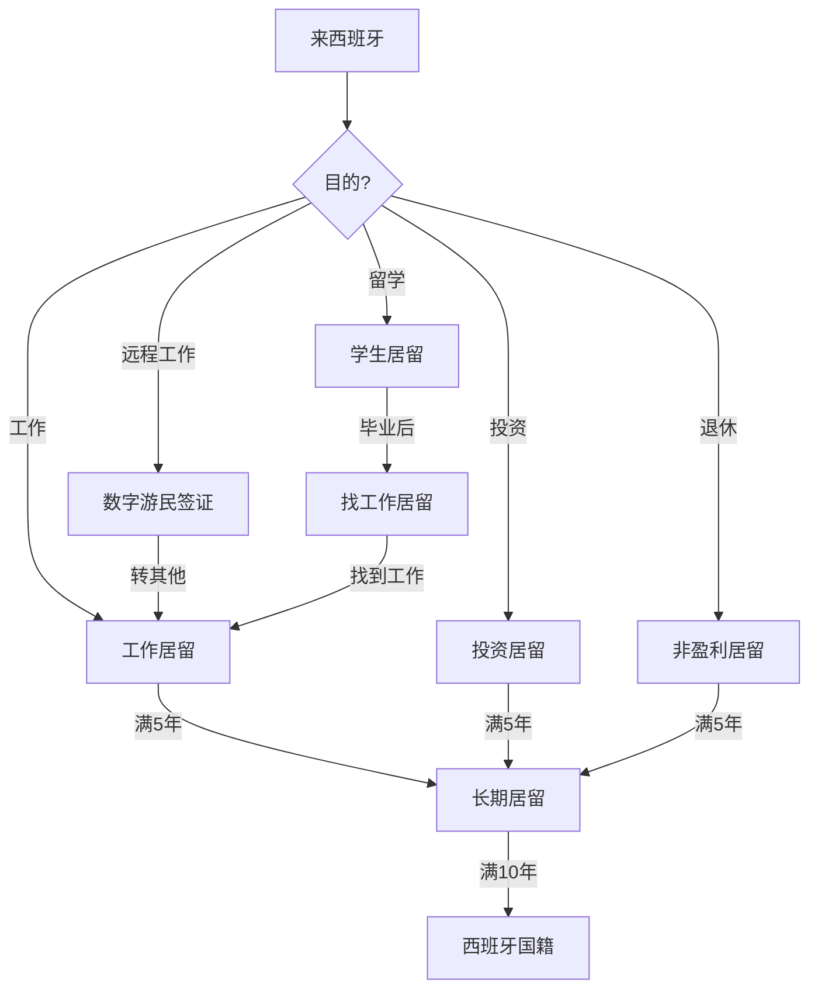

# 🛤️ 西班牙身份路径图谱

## 身份类型总览

## 📋 各路径详解

### 1️⃣ 学生居留 (Estudiante)

**适用人群:** 来西班牙读书的留学生

**要求:**
- 被西班牙教育机构录取
- 经济证明 (~€600/月)
- 医疗保险
- 无犯罪记录

**有效期:** 根据课程长度，通常1年，可续

**优势:**
- ✅ 门槛较低
- ✅ 可转找工作居留
- ✅ 允许打工 (每周20小时)

**劣势:**
- ❌ 不能全职工作
- ❌ 不能直接转长期居留

**成本估算:**
| 项目 | 费用 |
|------|------|
| 签证申请费 | €60-160 |
| 居留卡费 | €15-20 |
| 医疗保险 | €30-80/月 |
| 生活费 | €800-1500/月 |

---

### 2️⃣ 工作居留 (Trabajador)

**适用人群:** 在西班牙有工作合同的外国人

**获取途径:**

#### A. 从学生转工作
- 完成学业后申请 "找工作居留" (1年)
- 找到工作后转为工作居留

#### B. 直接申请
- 需要雇主申请工作许可
- 难度较大，需证明无欧盟人能胜任

**有效期:** 1年 → 2年 → 2年 → 长期居留

---

### 3️⃣ 非盈利居留 (No Lucrativa)

**适用人群:** 退休人士、有被动收入者

**要求:**
- 被动收入证明 (~€2400/月)
- 存款证明 (~€30,000)
- 无犯罪记录
- 医疗保险

**限制:**
- ❌ 不能在西班牙工作
- ✅ 可以远程为海外公司工作 (灰色地带)

**成本估算:**
| 项目 | 费用 |
|------|------|
| 签证申请费 | €80-120 |
| 翻译认证 | €200-500 |
| 医疗保险 | €50-150/月 |
| 生活费 | €1200-2500/月 |

---

### 4️⃣ 数字游民签证 (Digital Nomad Visa)

**适用人群:** 远程工作者、自由职业者

**要求 (2026):**
- 为西班牙境外公司远程工作
- 或自由职业者有海外客户
- 收入证明 (~€2000/月)
- 无犯罪记录

**优势:**
- ✅ 可以在西班牙居住
- ✅ 税率优惠 (24%固定税率，前6年)
- ✅ 可带家属

---

### 5️⃣ 投资居留 (Golden Visa - 已收紧)

**注意:** 2024年后政策大幅收紧

**剩余选项:**
- 购买€50万+ 房产 (即将取消)
- 购买€200万+ 国债
- 投资€100万+ 西班牙公司

---

## 🔄 居留转换路径

| 从 | 到 | 条件 | 难度 |
|----|----|------|------|
| 学生 | 找工作 | 完成学业 | ⭐ |
| 找工作 | 工作 | 找到工作 | ⭐⭐ |
| 学生 | 非盈利 | 有被动收入 | ⭐⭐⭐ |
| 非盈利 | 工作 | 住满1年+找到工作 | ⭐⭐⭐ |
| 工作 | 长期居留 | 住满5年+工作3年 | ⭐⭐ |
| 长期居留 | 国籍 | 住满10年 | ⭐⭐ |

---

## 📚 相关资源

- [[City_Database_Navarra|Navarra城市信息]]
- [[City_Database_Madrid|Madrid城市信息]]
- [[Cost_Database_2026|2026年成本数据库]]

---

*最后更新: 2026-03-01*
